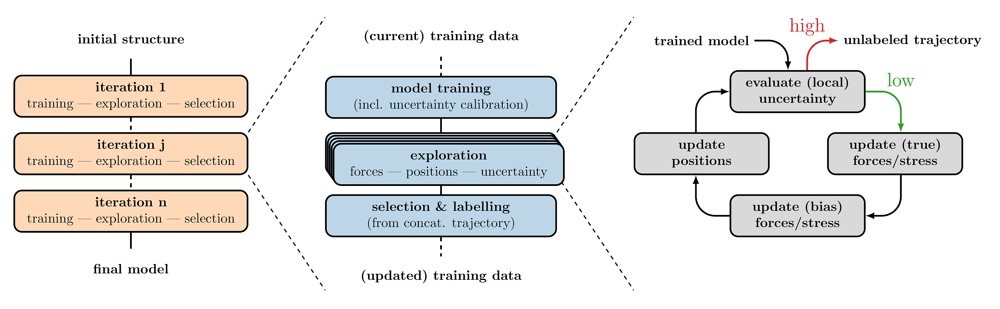

# ALEBREW: The Atomic Learning Environment for Building REliable interatomic neural netWork potentials

Official repository for the [paper](https://arxiv.org/abs/2312.01416) _"Uncertainty-biased molecular dynamics for learning uniformly accurate interatomic potentials"_. It comprises the package for building uniformly accurate machine-learned interatomic potentials using uncertainty-biased molecular dynamics and active learning. Data sets generated using this package and the configuration files necessary to reproduce the main results of the paper can be found at [Zenodo](https://doi.org/10.5281/zenodo.10776838). The logo for ALEBREW has been generated using DALL-E.

## Citing us

Please consider citing us if you find the code and paper useful:

    @misc{zaverkin2023uncertaintybiased,
      title={Uncertainty-biased molecular dynamics for learning uniformly accurate interatomic potentials}, 
      author={Viktor Zaverkin and David Holzmüller and Henrik Christiansen and Federico Errica and Francesco Alesiani and Makoto Takamoto and Mathias Niepert and Johannes Kästner},
      year={2023},
      eprint={2312.01416},
      archivePrefix={arXiv},
      primaryClass={physics.comp-ph}
    }

## Implemented methods

This repository implements

- Gaussian moment neural network potentials;
- Total and atom-based uncertainties for biasing and terminating atomistic simulations;
- Ensemble-free last-layer and sketched gradient-based features to compute posterior- and distance-based uncertainties;
- Ensemble-based uncertainties;
- Batch selection strategies to generate maximally diverse training data sets with active learning;
- Uncertainty calibration methods. We recommend to use inductive conformal prediction in the experiments;
- Interface with [ASE](https://wiki.fysik.dtu.dk/ase/) to run molecular dynamics simulations (NVT, NPT, etc.) and reference calculations;
- [Adversarial training](https://www.nature.com/articles/s41467-021-25342-8) to use with last-layer and sketched gradient-based uncertainties.

## License

This source code has a non-commercial license; see `LICENSE.txt` for more details.

## Requirements

An environment with [PyTorch](https://pytorch.org/get-started/locally/) (>=2.0.0), [BMDAL-REG](https://github.com/dholzmueller/bmdal_reg) (version 3) and [ASE](https://wiki.fysik.dtu.dk/ase/) (>=3.22.1) installed.  Also, some other dependencies may be necessary; see `alebrew-{cuda,cpu,mps}.yml` files.

## Installation

First, clone this repository into a directory of your choice `git clone https://github.com/nec-research/alebrew.git <dest_dir>`. Then, move to `<dest_dir>` and install the required packages into a conda environment using, e.g., `conda env create -f alebrew-{cuda,cpu,mps}.yml`. Finally, you can set your `PYTHONPATH` environment variable to `export PYTHONPATH=<dest_dir>:$PYTHONPATH`.

## Training potentials with a data set

Currently, we implement only Gaussian moment neural network potentials. You have to specify model parameters in the `config.yaml` file to train them using a data set. The default `config.yaml.default` file provides an example for training an interatomic potential for alanine dipeptide using the test data set from [Zenodo](https://doi.org/10.5281/zenodo.10776838). 

To use the default configuration, first, download the `ala2_test.extxyz` from [Zenodo](https://doi.org/10.5281/zenodo.10776838) and execute `cp config.yaml.default config.yaml`. Then, by running `python scripts/run_train.py config.yaml`, the training of a Gaussian moment neural network model starts, with the progress displayed in the `models/ala2/train.out` file; use, e.g., `tail -f models/ala2/train.out`. After training, potentials can be evaluated by running `python scripts/run_test.py config.yaml` with the test results evaluated on the data not used during training and stored in the `models/ala2/test_results.json` file.

## Generating data sets with ALEBREW from scratch

For the more complicated task of generating training data sets and training machine-learned interatomic potentials from scratch using our active learning workflow, we provide a more detailed tutorial in the `examples/using_alebrew.ipynb` Jupyter notebook.

## How to reproduce the results from the paper

To reproduce the results from the [paper](https://arxiv.org/abs/2312.01416) replace the parameters in the provided Jupyter notebook, i.e., `examples/using_alebrew.ipynb`, by those presented in the `config.yaml` files from `{ala2-ffs,mil53}/{task}/{learning_method}` at [Zenodo](https://doi.org/10.5281/zenodo.10776838). See also docstrings in `alebrew/task_execuption.py` for more information on possible parameters.